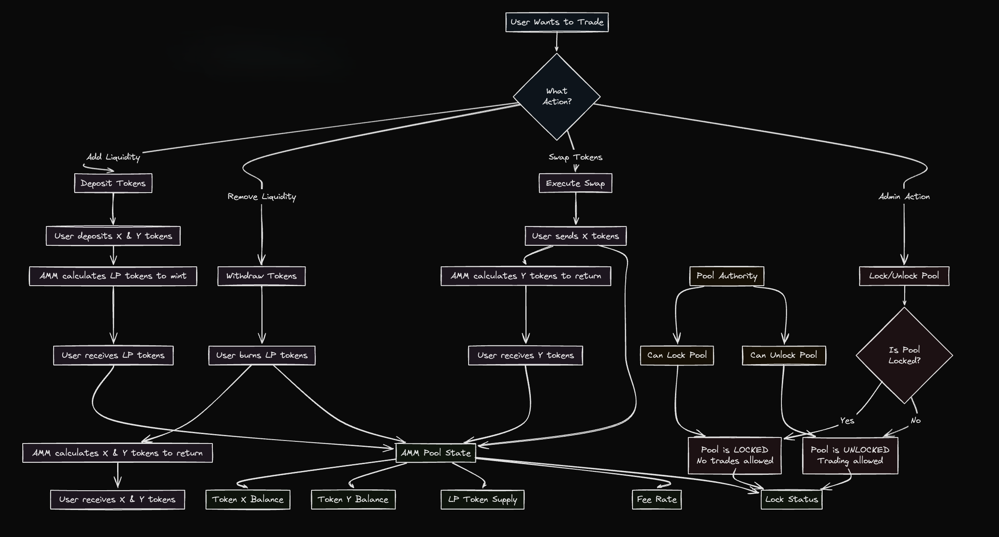

# Automated Market Maker (AMM)

An implementation of a decentralized **Automated Market Maker (AMM)** — enabling users to **swap tokens, add/remove liquidity, and manage pool configurations** without centralized intermediaries.

---

## Architecture

The AMM follows a **modular pool-based architecture**.  
Each liquidity pool maintains independent state variables that define its behavior and health:

- **Token X & Y Balances** – Current reserves in the pool  
- **LP Token Supply** – Tracks liquidity provider shares  
- **Fee Rate** – Defines swap fees applied per trade  
- **Lock Status** – Controls whether trading or liquidity actions are allowed  

The system supports three main user operations and one admin operation:

### User Flows
1. **Swap Tokens** – Users send token X, receive calculated amount of token Y based on pool ratio.  
2. **Add Liquidity** – Users deposit token pairs (X & Y) to mint LP tokens representing their share.  
3. **Remove Liquidity** – LP tokens are burned to withdraw the user’s proportional share of X & Y.

### Admin Flow
- **Lock / Unlock Pool** – Admin authority can pause or resume trading and liquidity operations to ensure security or during upgrades.

All actions update the **AMM Pool State**, maintaining balance consistency across:
- Token X Balance  
- Token Y Balance  
- LP Token Supply  
- Fee Rate  
- Lock Status  

---

## 🧩 Infrastructure & Implementation

- Smart contract logic handles **state updates**, **fee accounting**, and **liquidity math**.  
- Ensures **atomic operations** to prevent inconsistencies during high-frequency transactions.  
- Includes **role-based access control** for pool administration.  
- Designed for modularity — easily extendable to multi-token pools or advanced bonding curves.

---

## 🖼️ Architecture Diagram

---

Resources:
- [dean's AMM](https://github.com/deanmlittle/anchor-amm-2023)
- [YT - video](https://www.youtube.com/watch?v=QNPyFs8Wybk)
